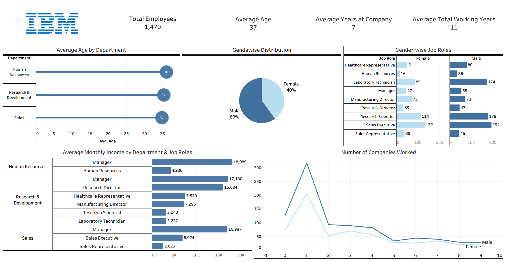
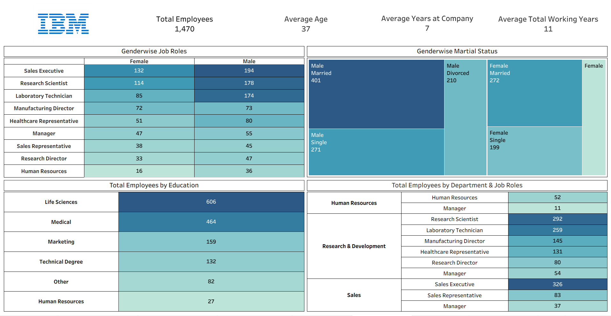

# 👨‍💼 IBM HR Data Analytics Dashboard (Tableau)

## 📊 Project Overview

An interactive Tableau dashboard designed to analyze IBM's employee data across departments, job roles, gender and education. This project highlights how Tableau can transform HR data into insightful visualizations for workforce planning, diversity analysis and compensation benchmarking.

---

## 🎯 Objectives

- Analyze employee distribution by department and job roles.
- Compare gender-wise participation and average income.
- Examine educational backgrounds and marital status.
- Visualize average age, tenure and total working experience.
- Explore insights on companies previously worked at.

---

## 📈 Key KPIs

- **Total Employees:** 1,470  
- **Average Age:** 37  
- **Average Years at Company:** 7  
- **Average Total Working Years:** 11

---

## 📌 Visual Highlights

### ✅ Gender-wise Job Roles
- Highest Female Role: **Sales Executive (132)**
- Highest Male Role: **Sales Executive (194)**

### 💰 Average Monthly Income
- Highest: **HR Manager – ₹18,089**
- Lowest: **Sales Representative – ₹2,626**

### 🏢 Departmental Insights
- **Top Department:** Research & Development  
  - Notably: Research Scientist (292), Lab Technician (259)

### 🎓 Educational Background
- Majority from **Life Sciences (606)** and **Medical (464)**

### 💍 Marital Status Distribution
- **Most Married:** Male Employees (401)
- **Most Single:** Male (271), Female (199)
- **Divorced:** Highest in Males (210)

---

## 🖼️ Dashboard Preview

 <!-- Replace with correct image path -->

---

### 📋 Employee Report Preview
 <!-- Replace with the actual path if hosted -->

---

## 🛠 Tools & Technologies Used

- **Tableau Public**
- **Calculated Fields & Filters**
- **Pie Charts, Bar Graphs, Line Charts, Tree Maps**
- **Interactive Dashboard Design**

---

## 📁 Files Included

- `IBM HR Data Analysis.twbx` – Tableau packaged workbook  
- `dashboard.png` – Dashboard preview image  
- `ibm_hr_report.png` – Employee Report   

---

## 🔍 Key Insights

- Sales Executive role has the highest employee count in both genders.
- Gender gap is visible, with **60% male** and **40% female** workforce.
- R&D is the most staffed department, with the highest-paying roles.
- Education plays a key role, with Life Sciences dominating.
- Majority of employees are married and have prior experience at 1–2 companies.

---

## 🚀 Future Improvements

- Add **attrition data** to track employee turnover.
- Integrate **salary progression by tenure** and performance.
- Include **employee satisfaction scores or surveys**.
- Implement **drill-down filters** by location, education, and age groups.

---

## 📧 Contact

For feedback or collaboration opportunities:  
**Author**: Sarthak Salvi  
**Email**: [sarthaksalvi2107@gmail.com](mailto:sarthaksalvi2107@gmail.com)

---

⭐ *If you found this project insightful, please give it a star on GitHub!*
